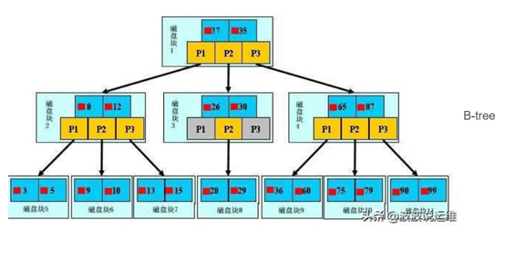
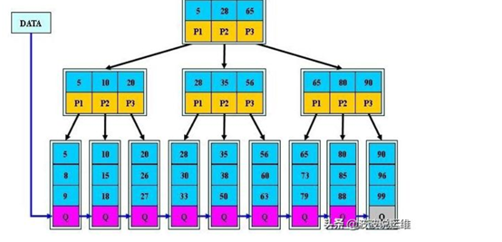

1. MyISAM与InnoDB的区别（锁，事务，索引，外键，mvcc）：1.myisam只支持表级锁，而Innodb支持表级锁和行级锁，默认为行级锁  2.只有innodb支持事务 3.只有innodb支持外键  4.只有innodb支持mvcc 5.innodb支持聚簇索引，myisam只支持非聚簇索引

2. Mysql事务(ACID:原子，一致，隔离，持久)：脏读，不可重复读，幻读，丢失修改。事务隔离级别：读写未提交，读写已提交，可重复读，可串行化

3. Mysql上的锁（行级锁3，表级锁，读写锁）：1.行级锁：record lock（给一条记录加锁，不能改变这条记录上的值），gap lock（记录本身不加锁，锁定记录边上的间隙，where A=10，不能插入/删除A=10的行），next-key lock（前两种锁的结合，锁定一个范围，可以解决幻读问题，where A between 10 and 30 确保10到30范围的既不能插入/删除，也不能修改）（说明：其中A为非唯一索引，RR隔离级别）2.表级锁：对当前操作的整张表加锁，实现简单 ，资源消耗也比较少，加锁快，不会出现死锁 。 3.读写锁：加了读锁还可以加读锁，不能加写锁，加了写锁不能加任何锁。Select虽然为读锁，但只有在**可串行化的隔离级别才加读**锁，**其他隔离级别因为mvcc，快照读**，不加锁。Update/insert/delete**加写锁**

4. 不同隔离级别的加锁情况（主键，唯一，普通，无）：RC：主键索引（锁定某一行），唯一索引（锁定某一行数据与二级索引），非唯一索引（给满足条件的行与二级索引加锁**record lock**），无索引（**先全表加锁，在释放不满足条件的锁**）  RR：唯一索引，主键索引于上同，非唯一索引（给满足条件的二级索引与行加**next-key**锁），无索引（**全表加**next-key锁），innodb默认为RR级别

5. Mvcc：是个行级锁的变种，它在普通读情况下避免了加锁操作（没有读锁也没有写锁），因此速度更快，缺点：每行记录都需要额外的存储空间，需要做更多的行维护和检查。快照读（即mvcc）：不加锁。**当前读**：可以指定读锁与写锁（**手动加锁**）如：select…lock in share mode;（读锁）  select…for update（写锁）  以上都是针对select语句，而update/insert/delete都是当前读，都要加写锁。

6. Mvcc的实现原理（innodb隔离原理）：undolog的工作过程：开始事务，记录数据行数据快照（旧数据）到undo log，更新数据（表中更新为新数据），将undo log写到磁盘，将数据写到磁盘，提交事务。Innodb通过undo log保存了已更改行的旧版本的信息的快照，InnoDB的内部实现中为每一行数据增加了三个隐藏列用于实现MVCC。DB_TRX_ID：插入或更新行的最后一个事务的**事务标识符**（相当于**创建时间**）。DB_ROLL_PTR：回滚指针，指向这条记录的上一个版本（存储于rollback segment（undolog）里）（相当于**删除时间**），如果对同一行记录执行连续的update操作，新记录与undo log会组成一个链表，遍历这个链表可以看到这条记录的变迁   DB_ROW_ID：行标识  MVCC只在READ COMMITED 和 REPEATABLE READ 两个隔离级别下工作。 在RR隔离级别下：Select：1. InnoDB只查找版本**早于当前事务版本**的数据行（也就是，行的系统版本号小于或等于事务的系统版本号），这样可以确保事务读取的行，要么是在事务开始前已经存在的，要么是事务自身插入或者修改过的。 2. 行的删除版本要么未定义，要么**大于当前事务版本号**（在此事务之后才被删除）。这可以确保事务读取到的行，在事务开始之前未被删除。  Insert：InnoDB为新插入的每一行保存当前系统版本号作为**行版本号。**(即创建时间)  Delete：InnoDB为删除的每一行保存当前系统版本号作为**行删除标识。** Update：InnoDB为插入一行新记录，保存当前系统版本号作为**行版本号**，同时保存当前系统版本号到原来的行作为**行删除标识**（即删除时间）记录的历史版本放置在undolog中，幻读通过mvcc+nextkey lock解决   https://www.cnblogs.com/stevenczp/p/8018986.html

7. 索引：**唯一索引**（unique，新插入数据时，检查字段值是否**重复**，重复则拒绝插入），**普通索引**（index，普通索引的唯一任务是加快**访问速度**，应该给那些经常出现的查询条件创建索引），**主键索引**（primary key，必须为表创建一个主键索引，如果没有指定，则系统默认帮我们创建）（主键为什么用自增ID而不是UUID：因为主键的一个作用就是排序，而uuid时随机的，其可能从中间插入，导致页的分裂，产生很多表碎片。如果是自增的，那么其有从小到大自增的，有顺序，那么在插入的时候就添加到当前索引的后续位置。当一页写满，就会自动开辟一个新的页。）

8. 为什么使用索引：1.通过唯一索引，可以确保表中数据的**唯一性** 2.加快检索**速度**  3.将随机IO变为**顺序IO**  4.加速表与表之间的连接，利于实现数据库**完整性**  为什么不每一个列都创建一个索引呢？1.对表中的索引修改时，索引也要维护，降低了数据的**维护**速度  2.索引需要占据**物理空间**  3.创建索引和维护索引需要耗费时间

9. Mysql基本存储结构：mysql的记录都存储在页中（页默认大小为16K），各个页可以组成一个**双向链表**，每个数据页中的记录（数据行）又可以组成一个**单向链表**，每个数据页都会为存储在它里边儿的记录生成一个**页目录**，在通过主键查找某条记录的时候可以在页目录中使用二分法快速定位到对应的槽，然后再遍历该槽对应分组中的记录即可快速找到指定的记录，以**非主键**作为搜索条件：只能从最小记录开始依次**遍历单链表**中的每条记录。页中的每条记录，页与页之间的记录，都是**有序**的。  查找顺序：先从根节点开始查找，定位到下一层的某个节点，然后逐层查找，直到数据存放的页，最后根据页目录查找出数据。

10. B树与B+树（结构，优点2）：B树的所有节点既**存放键(key) 也存放数据(data**);而B+树只有叶子节点存放 key 和 data，其他内节点只存放key。Mysql中，myisam与innodb使用的都是B+树。  为什么使用b+树？1.b+树的磁盘读写代价更低（相同数据时，b+树会更矮胖，相对b树加载的页就更少，IO次数更少）更稳定（因为只有叶节点存储数据，所以每次都要加载到叶节点），2.方便扫库，b树需要中序遍历，而b+树只需要扫描叶子节点。

    磁盘块2中的数据都小于磁盘块1，磁盘块3中的数据介于17，35之间，磁盘块5中的数据大于磁盘块1中的数据。

​                               

 								

11. 非聚簇索引与聚簇索引：非聚簇索引：即索引结构和数据分开存放的索引，**Myisam**使用的索引，innodb中使用的**二级索引**（唯一索引，普通索引都是二级索引，也叫辅助索引）都是非聚簇索引。聚簇索引：即索引结构和数据一起存放的索引，Innodb**主键**使用的索引为聚簇索引。二级索引可能回表，也可能不回表，如覆盖索引。Myisam中，B+树叶节点的data域存放的是**数据记录的地址**，在innodb中，二级索引存放的是索引和**主键的值**，需要查询的数据索引中没有时，只能回表。

12. 覆盖索引：覆盖索引即**需要查询的字段正好是索引的字段**，那么直接根据该索引，就可以查到数据了， 而无需回表查询。如index（name,city），如果只是根据name查询city，那么就没有回表。

13. 哈希索引：对于哈希索引来说，底层的数据结构就是哈希表，因此在绝大多数需求为单条记录查询的时候，可以选择哈希索引，查询性能最快，但是范围查询却无能为力。

14. 最左前缀：联合索引如index(name,id)是**先对name排序**，再对name相同的id排序，所以id可以说是无序的。所以如果查询name或者name与cid用的是ref查找类型，即用上了索引的二分查找，而**只查找cid**用的是index类型，即对整个索引进行**扫描**（查找的是联合索引的一部分才会运用此类型，也会触发索引）。mysql查询**优化器**：我们的索引是（name，cid），而查询用的是where name=xx and cid=xx，那么可以正常用索引进行查找，如果用的是where cid=xx and name=xx 呢？他就会帮我们优化成前一个查询。**最左前缀原则指的是**，如果查询的时候查询条件**精确匹配索引的左边一列或连续几列**，则此列就可以被用到，同时索引只能匹配相等，遇到**范围查询**如<,>，like等就不能进一步匹配了

15. 一条sql语句的执行过程：mysql主要分为两层：server层（主要包括连接器，查询缓存，分析器，优化器，执行器，日志模块binlog）与存储引擎层（负责数据的存储与读取，支持myisam与innodb等，其中innodb有日志模块redolog）。**连接器**：身份认证和权限相关(登录 MySQL 的时候) **查询缓存**：执行查询语句的时候，会先查询缓存（MySQL 8.0 版本后移除，因为这个功能不太实用） **分析器**：没有命中缓存的话，SQL 语句就会经过分析器，分析器说白了就是要先看你的 SQL 语句要干嘛，再检查你的 SQL 语句语法是否正确。  **优化器**：按照 MySQL 认为最优的方案去执行  **执行器**：执行语句，然后从存储引擎返回数据。

16. 一条写sql语句的执行过程（基本上按照查询流程走）：执行更新操作时需要用到日志模块：binlog（归档日志），所有的存储引擎都可以使用。Innodb还自带了一个日志模块redo log（重做日志）。顺序：调用innodb引擎的api接口，写入数据，innodb把数据保存在内存中，同时记录redo log，此时redo log 进入 prepare 状态，然后告诉执行器，执行完成了，随时可以提交。执行器收到通知后记录 binlog，然后调用引擎接口，提交 redo log 为提交状态，更新完成。  为什么redo log要引入prepare预提交状态？为了保持数据一致性，如果先写redo log直接提交，然后写bin log写完redo log后机器就挂了，那么binlog没有记录，后续备份时会造成数据丢失。先写binlog在写redo log时同理。

17. 大表优化（记录过多时）：1.限定数据范围：禁止不带任何数据范围条件的查找（即不能查找全部） 2.读写分离：主库负责写，从库负责读。 3.垂直拆分：根据列进行拆分，如把一张有10列的表拆分成两张各5列的表（可以减少I/O次数，简化表结构） 4.水平分区（分库）：表结构不变，表中的数据分散到不同的服务器上。两种分库常见方案：客户端代理（分片逻辑在应用端，封装在jar包中，通过修改或者封装JDBC层来实现），中间件代理（在应用和数据中间加了一个代理层。分片逻辑统一维护在中间件服务中）。

18. Sql执行顺序：form，join，on，where，group by，sum/avg，having，select，distinct，order by，limit  （group by是分组，与count与avg，sum等函数一起使用，用having限定分组，如限定只选取记录条数大于2的 having count(*)>2）(首先from拿到表，然后join与on把多表合成一个表，where从表中限定符合条件的行，对符合条件的行分组，对分组做操作如count计算，用having限定符合条件的分组，select选出初步结果，用distinct对结果去重，用order by对结果排序，用limit对结果限定条数)

19. Myisam为什么查询比较快？myisam适合于读多，并发少的场景。1.innodb寻址要映射到块，在到行，myisam记录的直接是文件的offset，定位比innodb快 2.innodb还要维护mvcc一致。

20. Explain：使用explain查询和分析sql的执行记录，可以进行sql的性能优化。用法：explain select * from table; 字段介绍：1.select_type查询类型，1.simple简单的select，不使用union或者子查询。2.type：从好到差依次为system>const>eq_ref>ref>range>index>all ，system表示表中只有一行数据（系统表） ，const表示使用主键或唯一索引（只读取一次）。  eq_ref表示唯一性索引扫描，对于每个索引键，表中只有一条数据与之匹配，常见于主键或唯一索引，与const的区别是他出现在**表连接中**，const为单表查询。  ref表示非唯一索引扫描，如name为索引，可能找到多个符合条件的行。   range表示只检索指定范围的行，一般在between/大于/小于/in等的查询，比全表扫描好，因为它只需要开始于索引的某一点，而结束于另一点，不用扫描全部索引 。  index遍历索引树，通常比All快，因为索引文件通常比数据文件小 。  all表示全表扫描。   3.Possible_keys：查询涉及到的字段上若存在索引，则该索引将被列出，但不一定被查询使用   4.key：查询中实际使用的索引，若没有使用索引，显示为NULL   5.ref：显示哪个字段或常数与index比较，如indexA='aa'则为const（'aa'为常数），如果使用函数计算出来的，ref就会显示func    6.rows：大致估算出找到所需的记录所需要读取的行数，也就是说，用的越少越好   7.key_len:显示索引字段的最大可能长度，并非实际使用长度，即**key_len是通过表定义计算来**的（utf-8编码一个char符3字节，null比not null的列多一个字节），不是表内检索出的，不损失精度的情况下，长度越短越好  8.id：id相同时，执行顺序由上到下，如果是子查询，id的序号会递增，id值越大优先级越高，越先被执行，id如果相同，可以认为是一组，从上往下顺序执行；在所有组中，id值越大，优先级越高，越先执行。 来源：https://blog.csdn.net/why15732625998/article/details/80388236

21. char与varchar的区别：char是固定长度存储，范围0-255字节（一个字母一个字节，一个汉字两个字节，使用utf-8字符集时，中文占3个字节），比如char(30)能存放30字节，内容不足30字节时，尾部以空格补齐。检索它的时候尾部空格会被去除。char善于存储长度相对固定的值，比如类型，ip等不容易产生碎片。varchar善于存储长短不一的值，以节省磁盘空间，范围0-65535字节，比如varchar(30)存放abcd实际使用5个字节，因为还需要一个字节来存放字符串长度（长度为0-255时额外需要一个字节，大于255时需要两个字节），update时，如果比原来的值大，可能需要开辟新的空间，会损耗性能，但innodb下查询效率比char高。  如果插入的长度超过了char与varchar呢？如果尾部要被截断的是非空格，在sql严格模式下，两者都不能插入，报错，在非严格模式下，会警告，但可以插入成功。如果尾部被截断的是空格，无论所处何种模式，varchar都可以插入成功，但会警告，char也可以插入成功，且无提示。为啥varchar尾部会有空格呢？比如"abc    "尾部就是空格。转换为mysql严格模式，在mysql配置文件my.cnf的sql_mode增加STRICT_TRANS_TABLES。

22. mysql常用查询优化（模糊，不等于，计算，函数，空，or，select *，order by，varchar）：1.有索引未被用到：用了like（LIKE %XXX不走索引，如果百分号在后面是走索引的），正则表达式不走索引，where不符合最左匹配（如索引是(a,b)而只用b查找），使用了!=或者<>(此符号是不等于运算符)符号（使用>或者<符号会比较高效），索引列参与运算（如where a+1>2，尽量使用where a>2-1这种），对字段进行null值判断（如where a is null），使用or连接条件可能会导致全表扫描（可以使用union all，把一个使用or的select分成两个，事实上两个相同的字段用or也是会走索引的(where a =1 or a=2)，只有两个不同的字段用or才会全表扫描(where a=1 or b=1)）。  2.避免使用select *在解析过程中这一步会转换成所有列名，需要耗费多余时间。3.order by优化：任何在Order by语句的非索引项或者有计算表达式都将降低查询速度。  4.使用varchar代替char     5.偶尔执行慢：redolog写满了，内存不够用，拿不到锁。       来源：https://juejin.im/entry/590a973561ff4b00698921b8#comment   

23. 事务(ACID)详解：A：原子：要么全部执行，要么全部不执行，C（一致性）：事务的执行不能破坏数据库的一致性，一致性也被称为完整性（如表连接中，订单表与物流表连接，订单表新增一行，物流表也要新增一行，不可能订单表新增了物流表没有新增），I（隔离性）：多个事务执行时，互不影响，D：一旦事务提交，所作的修改就会永久保存在数据库中。

24. 三大范式：第一范式：确保每列的原子性（不可再次拆分了）   第二范式：确保表中的每列都和主键相关，而不能只与主键的某部分相关（主要针对联合主键），确保完全依赖（如订单商品（主键为订单号商品号）要分为两个表，不能一个表，确保数据不会冗余）   第三范式：确保每列都和主键列直接相关,而不是间接相关，消除传递依赖。（如学生与老师虽然有教课关系，但学生表与老师表是要分开的）

25. sql查询优化：

    > 1. 模糊查询优化（http://blog.itpub.net/26736162/viewspace-2139039/）：
    > 2. object_name like ‘%ABC’时的优化：创建颠倒索引：create index idx_t1_objectname2 on t1(reverse(object_name));    使用：select object_name from t1 where reverse(object_name) like reverse('%LIB');   
    > 3. object_name like '%ABC%'时的优化：1. 情况一：ABC只从开头固定的位置出现（假设从第5位开始出现）：创建索引：create index idx_substr_t1_objname on t1 (substr(object_name,5,30));  substr(字符串，起始位置，长度)函数是取子串    使用：select object_name from t1 where substr(object_name,5,30) like 'TAB%';      2. 情况二：ABC从结尾的固定位置开始出现：创建索引：Create index idx_t1_reverse2 on t1(reverse(substr(object_name,1,length(object_name)-4)));     使用：select object_name from t1 where reverse(substr(object_name,1,length(object_name)-4)) like reverse('%TAB_COL');     3. 情况三：ABC出现的位置随机：改写后的sql语句：Select object_id ,object_type,object_name from t1 Where object_name in (select object_name from t1 where object_name like ‘%ABC%’);   执行计划是索引全扫描加索引回表操作。   优化原理：用索引全扫描取代表的全扫描。因为索引全扫描的代价是全表扫描的1/N (即索引块数与数据块数的比例），表越大，优化效果越明显。如果in子查询返回的记录数很少，那么优化的效果就相当于效率提高了N倍；如果in子查询返回的记录数较多，两种SQL的性能区别就不是很明显了

26. innodb磁盘读取：InnoDB 存储引擎中，所有的数据都被逻辑地存放在表空间中，表空间（tablespace）是存储引擎中最高的存储逻辑单位，在表空间的下面又包括段（segment）、区（extent）、页（page）。默认情况下，表空间中的页大小都为 16KB。单次从磁盘读取单位是页，而不是行，也就是说，你即便只读取一行记录，从磁盘中也是会读取一页的，当然了单页读取代价也是蛮高的，一般都会进行预读（使用缓冲池）。缓冲池管理器将尽力确保经常使用的数据被保存于池中，以避免一些不必要的磁盘读。如果一个索引或者表页在缓冲池中被找到，那么将会处理很快，每一个缓冲池都足够大，大到可以存放许多页，可能是成千上万的页。随机读取：即读取一个我们需要的页（如查询某个主键），读取一页大概需要10ms。顺序读取：即全表（或全索引）扫描，时间相比随机读取低很多。

27. 