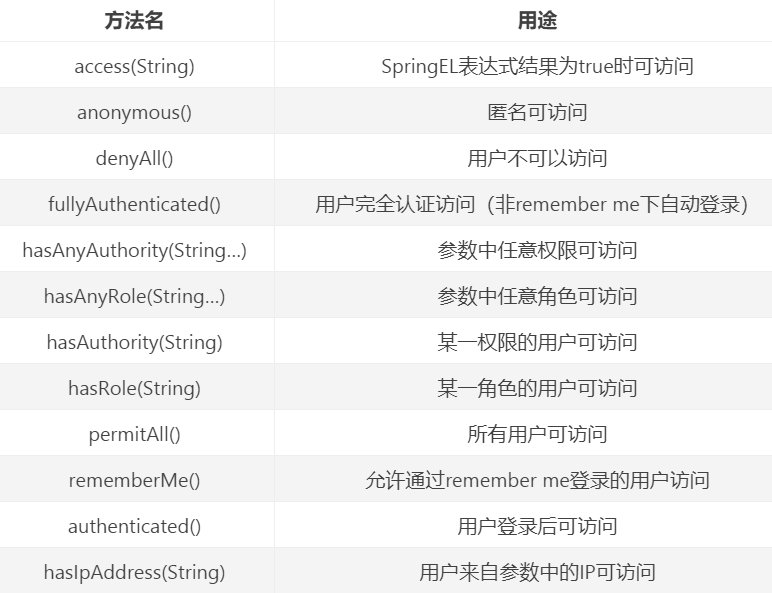

1. 前置学习

oAuth2.0：授权协议
用户认证后，为了避免用户的每次操作都进行认证，可将用户的信息保存在会话层中，如session，token等
服务端生成token，返回给客户端保存（可以保存在cookie，localstoage等），再次访问需要携带token，服务端解析token，并获得当前用户数据
授权数据模型：who对what（资源：功能资源，数据资源）进行how（权限）操作
为了方便给用户授权，创建角色（权限的打包）：用户表，角色表，权限表，用户角色表（用户与角色多对多），角色权限表（角色与权限多对多）
RBAC：授权方案（基于角色访问，基于资源访问）
基于角色访问：访问资源前要判断此用户是否拥有某角色，如果访问某一资源的角色增多了，要修改很多代码
基于资源：访问资源前要判断此用户是否拥有某访问资源权限，只要角色初始化时赋值了权限，后面不需改变（推荐）
session连接后自动生成，取得session只需要在controller方法中参数传入即可，sessionkey放到user类中，就是一个user对象
controller返回string需要配置produce为text/plain
权限控制：拦截器，在session中取出用户信息，校验用户权限与请求url比对

springsecurity不用自定义拦截器
继承websecurityconfigurerAdapter，@enablewebsecurity：配置用户信息，密码编码器，安全拦截机制（configure方法：配置登录，授权（配置拦截具体的url，不拦截则permmitAll，放在最下面），退出，csrf）
springboot会扫描当前目录以及当前子目录下面的所有类，所有不用配置扫描注解
集成springboot：配置websecurityconfig类
采用filter（filterchainproxy代理   authenticationmanager认证，accessdecisionmanager授权）与aop
filter：
1.securitycontextpersistencefilter，2.usernamepasswordauthenticationfilter（重要），3.filtersecurityinterceptor，4.exceptiontranslationflter
2将请求封装，交给authenticationmanager再委托给daoauthenticationProvider查询userdetailsservice获取用户信息，获取后返回userdetails，通过passwordencoder比对密码是否一致，
userdetailsservice通过我们配置的websecurityconfig中的userdetailsservice方法获取用户名密码
继承userdetailsservice实现loaduserbyusername方法加载用户与权限，写了这个类后，securityconfig中的配置用户信息的方法就不用写了
bcryptpasswordencoder加密，再security中配置passwordencoder返回此类，在pom中配置bcrypt依赖，用bcrypt.hashpw()方法加密密码（盐值不同，加密后的字符串不同，但是与原始密码校验都可以）
数据库中一定要存储加密后的密码，userdetailsservice返回的userdetails封装的就是加密后的密码，使用密码编码器，他会帮我们自动解码，然后与输入的密码比对

3获取用户访问受保护资源请求，通过securitymetadatasource获取当前资源所需权限，然后投票
三个投票实现类（投票：赞同，拒绝，弃权）：affirmativebased：只要有一个赞成就通过，全部弃权也通过  consensusbased：赞成多于反对则通过
unanimousbased：只要有一个反对就反对       不通过则抛出异常
从数据库查询权限（用户表，角色表，权限表，用户角色关系表，用户权限关系表），在userdetailsservice中授权
hasAuthority()基于资源授权，hasrole()基于角色授权/不推荐
方法授权：建议基于controller层的方法授权，@PreAuthorize（推荐使用，开启同secured）  @PostAuthorize  @Secured（开启：在配置类上写@EnableGlobalMethodSecurity（securedEabled=true））
@Secured（"IS_AUTHENTICATION_ANONYMOUS"）：可以匿名访问  @Secured（"ROLE_TELLER"）:具有teller的角色才能访问此方法
@PreAuthorize("isanonymous()")   @PreAuthorize("hasAuthority("p1")")：拥有p1权限

屏蔽掉csrf（跨站请求），可以在config中配置disable或者在请求页面加上token

Authentication接口获取用户身份，在用户访问资源时可以加上用户名
springsecurity配置session控制：always：没有session则创建一个，ifRequired（默认）：如果需要就创建一个session（登录时），never：永不创建，其他地方创建了也会使用，stateless：永不创建，也不使用
使用token时是不需要保存会话的，可以设置为stateless
可以设置退出url，设置logouthandle：退出成功时的清理工作等

分布式都有网关，通过了网关才能访问资源
分布式认证授权：每一个服务都写一个授权服务会冗余，所以需要共享：统一认证授权（UAA）（自己，外界都走这个授权服务）
认证方案：session：需要所有分布式实例都具有此session（session赋值，session粘贴，session集中存储）
token：token中存储了用户信息，缺点：数据量比较大，安全性问题   对第三方接入认证更适合，可使用当前流行的开放协议Oauth2.0，JWT等  更适合分布式
网关校验客户端权限（校验token，验证客户端权限），微服务验证用户权限
Oauth：允许用户授权第三方应用（网站）访问他们存储在另外的服务提供者（微信）上的信息，而不需要将用户名密码提供给第三方应用或访问他们的数据（如很多网站可以微信登录）
微信返回授权码（用户同意后），网站申请令牌（token，认证/授权服务器），微信返回令牌，网站获取用户信息（资源服务器），微信检验令牌合法后返回用户信息
认证授权服务器对两个角色授权：资源拥护者（用户），客户端（网站）
/oauth/authorize：认证  /oauth/token：访问令牌
分布式：父工程，子工程
配置：ClientDetailsServiceConfigure客户端详情配置，AuthorizationServerEndpointsConfigure配置令牌访问端点与令牌服务，AuthorizationServerSecurityConfigurer配置令牌端点的安全约束
token令牌存储：inMemoryTokenStore：默认，存储在服务器内存中，jdbcTokenStore：存储数据库中，JWTtokenStore（JSON WEB TOKEN）：不需要存储，写到令牌中（最好）

JWT：用户认证通过会得到一个JWT令牌，令牌中包含了用户相关的信息，客户端只需要携带JWT令牌访问资源服务，资源服务根据实现约定的算法自动完成令牌
校验，无需每次都请求认证/授权服务器。（不使用JWT令牌时，资源服务器每次都要请求授权服务器验证token，很麻烦）
token令牌对应了内存中的用户数据，如用户名，密码，权限等，也就是说token并不存储用户信息，只是对应内存中的用户信息。而JWT本身存储用户信息
JWT优点：基于json，易扩展，可以使用非对称/对称加密算法，资源服务器可以不依赖认证服务器   缺点：JWT数据长
JWT包含：头部信息，内容，签名

2. Jwts类的使用：

   > 1. jwt的格式：Header头部+Payload荷载+Signature签名。
   >
   >    Header一般由两部分组成：token的类型与使用的算法。
   >
   >    Payload部分是JWT存储信息的部分，包含着Claims（声明），其实就是存储的的数据，一般分为三种类型：1. Registered claims：预定义的声明，如ISS为发布者的URL地址，exp为JWT的失效时间，sub为JWT面向的用户，iat为issued at jwt发布时间（builder时的时间）。2. Public claims：公开字段（无用）。3. Private claims：自定义私有字段（可以在这个字段里定义要传递的用户信息等）***不能在此字段传递加密的信息***，这部分采用对称加密方式，传输内容可以被解开
   >
   >    Signature签名的用途显而易见就是验证前面部分的内容是否有被篡改（因为前面是对称加密的，容易修改）。
   >
   > 2. Jwts解析：用Jwts.parser()创建一个JwtParser对象，指定要使用的秘钥setSigningKey()，调用parseClaimsJws()方法，用try/catch块包裹这部分内容，方便jjwt处理异常
   >
   > 3. sdf

3. 用户名密码认证流程：用户使用用户名和密码登录，用户名密码被过滤器（默认为 UsernamePasswordAuthenticationFilter）获取到，封装成 Authentication（实现类：UsernamePasswordAuthenticationToken，传入用户名，密码，权限（空的集合）），token（Authentication实现类）传递给 AuthenticationManager 进行认证，AuthenticationManager 默认实现类为 ProviderManager ，ProviderManager 委托给 AuthenticationProvider 进行处理，AuthenticationManager 认证成功后返回一个封装了用户权限信息的 Authentication 对象。   其中，AuthenticationManager认证过程：DaoAuthenticationProvider（实现了AuthenticationProvider）：通过UserDetailsService 获取 UserDetails，将UserDetails 和 UsernamePasswordAuthentionToken 进行认证匹配用户名密码是否正确，若正确则通过 UserDetails 中用户的权限、用户名等信息生成一个新的 Authentication 认证对象并返回。

4. 相关类https://www.jianshu.com/p/ac42f38baf6e：

   > 1. UserDetailsService：该接口仅有一个方法 loadUserByUsername，Spring Security 通过该方法获取UserDetails，通常实现此接口来自定义从数据库等加载用户，再封装如UserDetails。
   >
   > 2. UserDetails：该接口提供了getUsername()，getPassword()，getAuthorities()等方法，用于对用户与权限的封装。可以自己实现该接口，供 Spring Security 安全认证使用，Spring Security 默认使用的是内置的 User 类。通过 Authentication.getPrincipal() 的返回类型是 Object，但很多情况下其返回的其实是一个 UserDetails 的实例。
   >
   > 3. Authentication：Authentication 是一个接口，用来表示用户认证信息，在用户登录认证之前相关信息（用户传过来的用户名密码）会封装为一个 Authentication 具体实现类对象，默认情况下为 UsernamePasswordAuthenticationToken（封装了Object类型的principal与credentials），登录之后（通过AuthenticationManager认证）会生成一个更详细的、包含权限的对象。其中，getPrincipal()是用户的身份信息，大部分情况下返回的是UserDetails接口的实现类。getAuthorities()，权限信息列表，默认是GrantedAuthority接口的一些实现类，通常是代表权限信息的一系列字符串
   >
   > 4. GrantedAuthority：GrantedAuthority 是一个接口，它定义了一个 getAuthorities() 方法返回当前 Authentication 对象的权限字符串，用户有权限是一个 GrantedAuthority 数组，每一个 GrantedAuthority 对象代表一种用户。通常使用他的实现类SimpleGrantedAuthority 。  此实现类都是以集合的形式作为用户权限存储在UserDetails中。
   >
   > 5. AuthenticationManager：AuthenticationManager 是用来处理认证请求的**接口**，它只有一个方法 authenticate()，该方法接收一个 Authentication 作为对象，如果认证成功则返回一个封装了当前用户权限信息的 Authentication 对象进行返回。他默认的实现是 ProviderManager，但它不处理认证请求，而是将委托给 AuthenticationProvider 列表（List<AuthenticationProvider>），然后依次使用 AuthenticationProvider 进行认证，如果有一个 AuthenticationProvider 认证的结果不为null，则表示成功（否则失败，抛出 ProviderNotFoundException），之后不在进行其它 AuthenticationProvider 认证，并作为结果保存在 ProviderManager。认证校验时最常用的方式就是通过用户名加载 UserDetails，然后比较 UserDetails 密码与请求认证是否一致，一致则通过，Security 内部的 DaoAuthenticationProvider 就是使用这种方式。认证成功后加载 UserDetails 来封装要返回的 Authentication 对象，加载的 UserDetails 对象是包含用户权限等信息的。
   >
   > 6. AuthenticationProvider：是一个身份认证接口，实现该接口来定制自己的认证方式。该接口有两个方法：*Authentication authenticate(Authentication authentication)*：认证处理，返回一个 Authentication 的实现类则代表成功，返回 null 则为认证失败。s*upports(Class<?> aClass)*：如果该 AuthenticationProvider 支持传入的 Authentication 认证对象，则返回 true 
   >
   > 7. AuthorityUtils：是一个工具包，用于操作 GrantedAuthority 集合的实用方法。c*ommaSeparatedStringToAuthorityList(String authorityString)*：从逗号分隔符中创建 GrantedAuthority 对象数组。
   >
   > 8. AbstractAuthenticationProcessingFilter：该抽象类继承了 GenericFilterBean，是处理 form 登录的过滤器，与 form 登录相关的所有操作都在该抽象类的子类中进行（UsernamePasswordAuthenticationFilter 为其子类），比如获取表单中的用户名、密码，然后进行认证等操作。该类在 doFilter 方法中通过 **attemptAuthentication()** 方法进行用户信息逻辑认证，认证成功会将用户信息设置到 Session 中。
   >
   > 9. HttpSecurity：1. authorizeRequests()：返回一个配置对象用于配置请求的访问限制  2.antMatchers：匹配请求路径或请求动作类型，如：`.antMatchers("/admin/**")`    3.addFilterBefore: 在某过滤器之前添加 filter   4.addFilter()：添加过滤器   5. hasRole：结合 antMatchers 一起使用，设置请求允许访问的角色权限或IP，如`.antMatchers("/admin/**").hasAnyRole("ROLE_ADMIN","ROLE_USER")` 
   >
   >    
   >
   > 10. AuthenticationManagerBuilder：用于构建AuthenticationManager认证，允许快速构建内存认证（auth.inMemoryAuthentication()），LDAB身份认证，JDBC身份验证（auth.jdbcAuthentication()），添加UserDetailsService与AuthenticationProvider（定义认证方式）。
   >
   > 11. sdf

5. 常用注解：1. @**EnableWebSecurity**：开启 Spring Security 注解   2. @**EnableGlobalMethodSecurity(prePostEnabled=true)**：开启security方法注解   3. @**PreAuthorize**：在方法调用前，通过SpringEL表达式限制方法访问，如@PreAuthorize("isanonymous()")匿名可以访问   @PreAuthorize("hasAuthority("p1")")：拥有p1权限可以访问   4. @Secured不支持EL表达式，不推荐使用   5. @PostAuthorize：在方法执行后再进行权限验证，支持EL表达式

   

   

6. 密码加密：spring 提供的一个用于对密码加密的接口，首选实现类为 BCryptPasswordEncoder。

7. 过滤器chain：**SecurityContextPersistenceFilter**，SebAsyncManagerIntegrationFilter，HanderWriterFilter，CsrfFilter，LogoutFilter，**UsernamePasswordAuthenticationFilter**，DefaultLoginPageGeneratingFilter，**BasicAuthenticationFilter**，RequestCacheAwareFilter，SecurityContextHolderAwareRequestFilter，**AnonymousAuthenticationFIlter**，SessionManagementFilter，**ExceptionTranslationFilter**，**filterSecurityInterceptor**  注意，**security的一系列功能都是由过滤器完成的**   

8. 过滤器链：

   > 1. SecurityContextPersistenceFilter：请求在到达 UsernamePasswordAuthenticationFilter 之前都会先经过 SecurityContextPersistenceFilter。此类实现：每一个请求到达服务端的时候，首先从 session 中找出来 SecurityContext ，然后设置到 SecurityContextHolder 中去，方便后续使用，当这个请求离开的时候，SecurityContextHolder 会被清空，SecurityContext 会被放回 session 中，方便下一个请求来的时候获取。  流程：在 doFilter 方法中，它首先会从 repo 中读取一个 SecurityContext 出来，这里的 repo 实际上就是 HttpSessionSecurityContextRepository，读取 SecurityContext 的操作会进入到 readSecurityContextFromSession 方法中，在这里我们看到了读取的核心方法 `Object contextFromSession = httpSession.getAttribute(springSecurityContextKey);`，这里的 springSecurityContextKey 对象的值就是 **SPRING_SECURITY_CONTEXT**，读取出来的对象最终会被转为一个 SecurityContext 对象。在拿到 SecurityContext 之后，通过 SecurityContextHolder.setContext 方法将这个 SecurityContext 设置到 ThreadLocal 中去。接下来，通过 chain.doFilter 让请求继续向下走（这个时候就会进入到 `UsernamePasswordAuthenticationFilter` 过滤器中了，在过滤器链走完之后，数据响应给前端之后，finally 中还有一步收尾操作，这一步很关键。这里从 SecurityContextHolder 中获取到 SecurityContext，获取到之后，会把 SecurityContextHolder 清空，然后调用 repo.saveContext 方法将获取到的 SecurityContext 存入 session 中。获取不到用户信息：https://juejin.im/post/6844904111393996813
   > 2. AnonymousAuthenticationFilter：`Spirng Security` 为了整体逻辑的统一性，即使是未通过认证的用户，也给予了一个匿名身份。而 `AnonymousAuthenticationFilter` 该过滤器的位置也是非常的科学的，它位于常用的身份认证过滤器（如 `UsernamePasswordAuthenticationFilter、BasicAuthenticationFilter、RememberMeAuthenticationFilter` ）之后，意味着只有在上述身份过滤器执行完毕后，`SecurityContext` 依旧没有用户信息，`AnonymousAuthenticationFilter` 该过滤器才会有意义—-基于用户一个匿名身份。
   > 3. ExceptionTranslationFilter：`ExceptionTranslationFilter` 异常转换过滤器位于整个 `springSecurityFilterChain` 的后方，用来转换整个链路中出现的异常，将其转化，顾名思义，转化以意味本身并不处理。一般其只处理两大类异常：`AccessDeniedException` 访问异常和 `AuthenticationException` 认证异常。这个过滤器非常重要，因为它将 `Java` 中的异常和 `HTTP` 的响应连接在了一起，这样在处理异常时，我们不用考虑密码错误该跳到什么页面，账号锁定该如何，只需要关注自己的业务逻辑，抛出相应的异常便可。如果该过滤器检测到 `AuthenticationException` ，则将会交给内部的 `AuthenticationEntryPoint` 去处理，如果检测到 `AccessDeniedException`，需要先判断当前用户是不是匿名用户，如果是匿名访问，则和前面一样运行`AuthenticationEntryPoint`，否则会委托给`AccessDeniedHandler` 去处理，而 `AccessDeniedHandler` 的默认实现，是 `AccessDeniedHandlerImpl` 。所以 `ExceptionTranslationFilter` 内部的 `AuthenticationEntryPoint` 是至关重要的，顾名思义：认证的入口点。
   > 4. FilterSecurityInterceptor：由什么控制哪些资源是受限的，这些受限的资源需要什么权限，需要什么角色…这一切和访问控制相关的操作，都是由 `FilterSecurityInterceptor` 完成的。`FilterSecurityInterceptor` 从 `SecurityContextHolder` 中获取 `Authentication` 对象，然后比对用户拥有的权限和资源所需的权限

9. Postman中的发送请求Body格式：1. form-date：就是http请求中的multipart/form-data,它会将表单的数据处理为一条消息，以标签为单元，用分隔符分开。既可以上传键值对，也可以上传文件。当上传的字段是文件时，会有Content-Type来说明文件类型；content-disposition，用来说明字段的一些信息；由于有boundary隔离，所以multipart/form-data既可以上传文件，也可以上传键值对，它采用了键值对的方式，所以可以上传多个文件。  2. x-www-form-urlencoded：就是application/x-www-from-urlencoded,会将表单内的数据转换为键值对，当模拟表单上传数据时，用此选项，但当然此表单不能上传文件，只能是文本格式，要上传文件，使用上面的格式。比如,name=ah&age = 23   区别：multipart/form-data：既可以上传文件等二进制数据，也可以上传表单键值对，只是最后会转化为一条信息；  x-www-form-urlencoded：只能上传键值对，并且键值对都是间隔分开的。  3. raw：可以上传任意格式的文本，可以上传text、json、xml、html等，其实主要的还是传递json格式的数据，当后端**要求json数据格式**的时候，就要使用此种格式来测试。  4. binary：相当于Content-Type:application/octet-stream,只可以上传二进制数据，通常用来上传文件，由于没有键值，所以，一次只能上传一个文件。

10. 两种授权方法：web授权与方法授权，web（filtersecurityinterceptor）：通过url拦截进行授权，方法（methodsecurityinterceptor）：通过方法拦截进行授权。在代码中，web授权为security配置类中的授权，方法授权是通过Controller中@PreAuthorize等授权。

11. 授权相关类https://wiki.jikexueyuan.com/project/spring-security/core-classes.html：

    > 1. SecurityContext：安全上下文接口，即存储认证授权的相关信息，实际上就是存储"**当前用户**"账号信息和相关权限（存储的是Authentication类）。这个接口只有两个方法，Authentication对象的getter、setter。（使用token与jwt时，因为用户信息都是存储在token中，需要SecurityContext时，我们可以根据token生成SecurityContext）   SecurityContext默认存储在ThreadLocal中，在每一次 request 结束后都将清除当前线程的 ThreadLocal。
    > 2. SecurityContextHolder工具类（是用来保存SecurityContext）：SecurityContextHolder工具类就是**把SecurityContext存储在当前线程**中。SecurityContextHolder可以**用来设置和获取SecurityContext**。它主要是给框架内部使用的，可以利用它获取当前用户的SecurityContext进行请求检查，和访问控制等。在Web环境下，SecurityContextHolder是**利用ThreadLocal来存储SecurityContext**的。   通过调用 SecurityContextHolder.getContext().setAuthentication(...)  将 Authentication 对象赋给当前的 SecurityContext
    > 3. SecurityContextPersistenceFilter：SecurityContextPersistenceFilter是Security的拦截器，而且是拦截链中的第一个拦截器，请求来临时它会从HttpSession中把SecurityContext取出来，然后放入SecurityContextHolder。在所有拦截器都处理完成后，再把SecurityContext存入HttpSession，并清除SecurityContextHolder内的引用。
    > 4. 异常处理类：AuthenticationEntryPoint 用来解决匿名用户访问无权限资源时的异常，AccessDeineHandler 用来解决认证过的用户访问无权限资源时的异常。
    > 5. session与securitycontext：既然 SecurityContext 是存放在 ThreadLocal 中的，而且在每次权限鉴定的时候都是从 ThreadLocal 中获取 SecurityContext 中对应的 Authentication 所拥有的权限，并且不同的 request 是不同的线程，为什么每次都可以从 ThreadLocal 中获取到当前用户对应的 SecurityContext 呢？在 Web 应用中这是通过 **SecurityContextPersistentFilter** 实现的，默认情况下其会在每次请求开始的时候从 session 中获取 SecurityContext，然后把它设置给 SecurityContextHolder，在请求结束后又会将 SecurityContextHolder 所持有的 SecurityContext 保存在 session 中，并且清除 SecurityContextHolder 所持有的 SecurityContext。这样当我们**第一次访问系统的时候**，SecurityContextHolder 所持有的 **SecurityContext 肯定是空**的，待我们登录成功后，SecurityContextHolder 所持有的 SecurityContext 就不是空的了，且包含有认证成功的 Authentication 对象，待请求结束后我们就会**将 SecurityContext 存在 session 中**，等到下次请求的时候就可以从 session 中**获取到该 SecurityContext** 并把它赋予给 SecurityContextHolder 了，由于 SecurityContextHolder 已经持有认证过的 Authentication 对象了，所以下次访问的时候也就不再需要进行登录认证了。 注意，**这是针对默认session模式即ifRequired**，如果使用stateless（即jwt），需要每次都获取token（即在BasicAuthenticationFilter拦截器中解析token）。  如果使用session，不需要配置鉴权拦截器，只需要在configure中配置即可，他会自动获取securityContext。  
    > 6. 使用session如何获取登录信息（Authentication）？1. 使用SecurityContextHolder.getContext().getAuthentication()  2. 在Controller 的方法中，加入 Authentication 参数。 正常情况下，我们通过如上两种方式的任意一种就可以获取到已经登录的用户信息。异常情况，就是这两种方式中的任意一种，都返回 null。都返回 null，意味着系统收到当前请求时并不知道你已经登录了（因为你没有在系统中留下任何有效信息），当你发送任何请求，系统都会给你返回 401（HTTP401错误代表用户没有访问权限，需要进行身份认证）。
    > 7.  springsecurity配置session控制：always：没有session则创建一个，ifRequired（默认）：如果需要就创建一个session（登录时），never：永不创建，其他地方创建了也会使用，stateless：永不创建，也不使用。
    > 8. asd

12. **postman开启cookie**：https://blog.csdn.net/xiangyubobo/article/details/51686215，如果需要用session，那么用postman测试时就需要开启cookie。

13. 自定义登录页与登录请求方法与url：

14. CORS（跨域）：跨域：在浏览器上当前访问的网站向另一个网站发送请求获取数据的过程就是跨域请求。同源策略就是向服务端发起请求的时候，以下三项必须与当前浏览器应用一致：域名、端口、协议，用白话说：就是你的应用发送请求**不能访问别人的资源**，否则浏览器就会限制你。当然也有例外，如：img、srcipt、iframe等资源引用的HTML标签不受同源策略的限制。如果缺少了同源策略，浏览器很容易受到XSS、CSRF等攻击。但是我们实际开发中又经常会跨站访问，比如前后端分离的应用是分开部署的，在浏览器看来是两个域。所以同源策略是用来禁止跨域访问的，CORS正好相反是根据自己的需求与规则，有限的开放部分资源的共享。在spring security中配置跨域可以允许别人访问我们的后端资源：在configure中开启，然后配置一个返回CorsConfigurationSource的@Bean

15. XSS（跨站脚本攻击）：XSS 攻击，一般是指攻击者通过在网页中注入恶意脚本，当用户浏览网页时，恶意脚本执行，控制用户浏览器行为的一种攻击方式。危害：窃取用户Cookie，获取用户隐私，盗取用户账号。劫持用户（浏览器）会话，从而执行任意操作，例如进行非法转账、强制发表日志、发送电子邮件等。 XSS 攻击的本质就是输入的内容被当做程序执行了，所以我们对于用户输入的内容不能完全的信任，需要考虑如何避免其被当做程序执行。  防御方法：**浏览器自带**X-XSS-Protection，**转义**：在 XSS 攻击中，攻击者主要是通过构造特殊字符来注入脚本，所以对用户的输入进行检测就很有必要，并且需要在客户端与服务端都进行输入检测，然后对用户输入的数据进行转义。  **过滤**：在富文本中因为需要保留 HTML ，所以我们不能使用转义的方法防御 XSS 攻击，这里使用过滤的方式防御 XSS 攻击，也就是通过只使用白名单允许的 HTML 标记及其属性，来防御攻击。**内容安全策略（CSP）**：实质就是白名单制度，开发者明确告诉客户端，哪些外部资源可以加载和执行，大大增强了网页的安全性。

16. sdf

17. sfd

