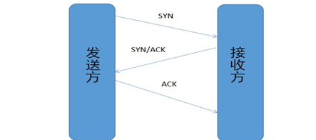
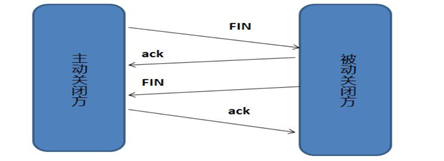
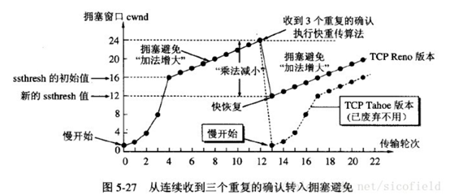
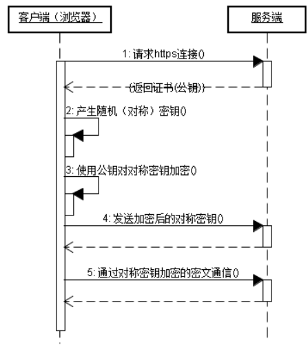

1. TCP三次握手四次挥手的原因：

   

​                               

​										

 

最初两端TCP进程都处于关闭状态，然后接收方进程创建传输控制块TCP，服务器进程进入**收听**（LISTEN）状态。发送方也是首先创建传输控制块TCP，然后发送SYN后进入**同步已发送状态**（SYN-SENT）。接受方收到SYN并且同意建立连接后发送SYN与ACK并且进入**同步收到**（SYN-RCVD）状态。发送方接受到确认后，还要发送一次ACK，并进入**已建立连接状态**（ESTABLISHED）。接受方收到ACK后也进入已**建立连接状态**。（为什么最后还要发送一次ACK呢/为什么要三次握手？为了防止当发送方发送多次请求建立连接的报文时，某个报文延迟到连接已经断开后才到达，这时接收方发送一个SYN,ACK报文给发送方，而发送方并不会返回任何信息给接收方（因为它的传输任务已经在上一次连接中完成了），如果没有最后一次的ACK，连接建立后，接收方会一直等待发送方发送报文，白白浪费资源，而加入了最后的ACK确认机制，当过一段时间没有接收到发送方最后的ACK时，接收方就会关闭，而不会一直等待。）A（SYN-SENT,ESTABLISHED）B（LISTEN，SYN-RCVD,ESTABLISHED）

 									

 									

A发送FIN后进入终止等待1状态（FIN-WAIT-1），B接受FIN并发送ACK后进入等待关闭状态（CLOSE-WAIT），这时A已经没有数据要发送了，但若B发送数据，A仍要接受。A收到ACK后进入终止等待2状态（FIN-WAIT-2）。若B已经没有要发送的数据了，则向A发送FIN，进入最后确认状态（LAST-ACK）。A发送ACK后进入时间等待（TIME-WAIT）状态，现在TCP连接还没有关闭，必须等待一定的时间（默认4分钟）A才进入CLOSED状态。B接受到ACK后立刻关闭。A（FIN-WAIT-1,FIN-WAIT-2,TIME-WAIT）B（CLOSE-WAIT,LAST-ACK）。为什么最后A要等待四分钟呢？（1.防止ACK报文丢失，当B长时间没有接受ACK报文时，会重新发送FIN+ACK报文给A，A则重新发送ACK并重新等待4分钟。）

2. 网络协议有哪些层？物理层（引脚标准等），数据链路层（PPP），网络层（IP，ARP），运输层（TCP,UDP），应用层（DNS,HTTP,STMP等）。物理层：在物理层上所传送的数据单位是比特。 物理层(physical layer)的作用是实现相邻计算机节点之间比特流的透明传送，**尽可能屏蔽掉具体传输介质和物理设备的差异**  数据链路层：数据链路层将网络层交下来的 IP 数据报**组装成帧**，在两个相邻节点间的链路上传送帧。每一帧包括数据和必要的控制信息（如同步信息，地址信息，差错控制等） 网络层：进行通信的两个计算机之间可能会经过很多个数据链路，也可能还要经过很多通信子网。网络层的任务就是**选择合适的网间路由和交换结点**， 确保数据及时传送。  运输层：就是跨主机两个进程之间通信，比如用tcp之类的，端口端口之间搭建通道，就是传输层解决的。**让两个进程可以实现通信。屏蔽了网络，物理等底层**。  应用层：应用层协议定义的是应用进程（进程：主机中正在运行的程序）间的通信和交互的规则

3. TCP与UDP的区别：1.UDP无连接  2.UDP不保证可靠交付  3.UDP面向报文，TCP面向字节流  4.UDP没有拥塞控制  5.UDP支持1对1，1对多，多对1，多对多，而TCP只能1对1 6.UDP首部开销小（只有8字节）。

4. **http状态码和每个状态码含义**：（https://juejin.im/post/590082e6a22b9d0065be1a5c#comment）1xx：代表请求已被接受，需要继续处理。这类响应是**临时响应**，只包含状态行和某些可选的响应头信息，并以空行结束。（102：处理将被继续执行）  2xx：**成功**，代表请求已成功被服务器接收、理解、并接受（200：成功，201：已创建，202：已接收但未处理）  3xx：**重定向**，代表需要客户端采取进一步的操作才能完成请求。通常，这些状态码用来重定向，后续的请求地址（重定向目标）在本次响应的Location域中指明。（301表示请求的网页已经被永久移动到新位置  **304表示请求的网页未更改，可以直接用客户端缓存**） 4xx：**客户端错误**（如400表示服务器不理解请求语法，404表示服务器找不到请求的网页）  5xx：**服务器错误**（503表示服务暂时无法使用）

5. 输入url回车后发送了什么：https://zhuanlan.zhihu.com/p/80551769 1.url解析（判断你输入的是一个合法的 URL 还是一个待搜索的关键词） 2.dns查询（查询网址的ip） 3.tcp连接（客户端发起tcp连接）  4.处理请求（服务器处理请求）  5.接受响应  6.渲染页面

6. URI和URL的区别：URI（统一资源标识符）**包括URL**（统一资源定位符）和URN，URI用来**唯一的标识**一个资源，URL是一种具体的URI，可以用来**标识**一个资源，而且还指明了如何**定位**这个资源。URI一般包括：访问资源的命名机制，存放资源的主机名，资源自身的名称，由路径表示，着重强调于资源。 URL一般包括：协议，存有该资源的主机IP地址(有时也包括端口号)，主机资源的具体地址。如目录和文件名等。

7. Get与post的区别：1.get相当于select，post相当于insert，update，delete，get请求的数据放在url中可以被看到。

    ​	

   Get请求不走缓存：1.在get请求后面拼接随机数或者时间戳  2.服务器端设置header(“Cache-Control: no-cache, must-revalidate”)

8. 网络7层模型：物理层，数据链路层，网络层，运输层，会话层，表示层，应用层。 多出了会话层（session，它定义了如何开始、控制和结束一个会话，包括对多个双向消息的控制和管理，以便在只完成连续消息的一部分时可以通知应用，从而使表示层看到的数据是连续的）与表示层（这一层的主要功能是定义数据格式和加密，例如FTP（文件传输协议）允许使用二进制或者ASCII传输）。

9. 路由器工作过程：收到数据包后，解封以太网帧头部，提取目的MAC地址，查看目的MAC地址是不是自己本身的MAC地址，如果不是自己的MAC地址则丢弃，如果是自己的MAC地址，上传到上层解析IP层，并判断ip地址是否是本机，如果是本机则上传到上一层，如果不是则查询路由表，匹配出接口，然后根据下一跳ip地址到ARP表中查询下一跳的MAC地址，如果没查到就发送ARP请求查找MAC地址，最后把MAC地址封装，发送。

10. 路由表：1.目标网络地址和网络掩码。发送来的IP数据报中的IP地址与网络掩码想与等于网络地址，则从此接口发送出去。（一般包括默认路由，即没在表中的网络地址都走默认路由） 2.网关，即到达目标网络的下一跳服务器地址（即于当前路由器相邻的下一个路由器的地址）。 3.接口，到达目标网络，本地计算机用于发送数据包的接口。

11. Arp协议：首先，每个主机都会在自己的ARP缓冲区中建立一个**ARP列表**，以表示IP地址和MAC地址之间的对应关系。当源主机要发送数据时，首先检查ARP列表中是否有对应IP地址的目的主机的MAC地址，如果有，则直接发送数据，如果没有，就向本网段的所有主机**发送ARP数据包**，该数据包包括的内容有：源主机 IP地址，源主机MAC地址，目的主机的IP 地址。当本网络的所有主机收到该ARP数据包时，首先检查数据包中的**IP地址是否是自己的IP地址**，如果不是，则忽略该数据包，如果是，则首先从数据包中取出源主机的IP和MAC地址写入到ARP列表中，如果已经存在，则覆盖，然后将自己的MAC地址写入ARP响应包中，告诉源主机自己是它想要找的MAC地址。源主机收到ARP响应包后。将目的主机的IP和MAC地址写入ARP列表，并利用此信息发送数据。如果源主机一直没有收到ARP响应数据包，表示ARP查询失败。

12. （https://blog.csdn.net/qq_36953135/article/details/77506009）拥塞控制就是为了防止过多的数据注入到网络中，这样就可以使网络中的路由器或链路不过载。 慢开始：如果立刻把大量数据字节注入到网络，那么可能会引起网络阻塞，较好的方法是从小到达逐渐增大发送窗口（拥塞窗口以字节为单位），cwnd初始为1，每经过一次传播轮次，**cwnd加倍**。一旦出现超时重传，TCP就把ssthresh的值设置为当前cwnd的一半，同时当前cwnd重置为1。  拥塞避免：让拥塞窗口cwnd缓慢增大，每经过一个往返时间就把**cwnd+1**。  快重传与快恢复：如果接受方收到一个乱序（1，3就是乱序）的报文段就立刻会送一个ACK给发送方，如果发送方一连收到3个重复的确认，就应该立刻发送接受方未收到的报文。发送方认为现在的网络可能没有出现拥塞（如果网络发生了严重拥塞，就不会一连有好几个报文段连续到达接收方，也就不会导致接收方连续发送重复确认）， 那么将**cwnd设置为ssthresh的大小**，然后执行拥塞避免算法。

     						

13. Ping命令协议：icmp，网络层

14. http与https的区别：http以明文发送内容，不提供任何数据加密。https加入了**ssl协议**，ssl依靠证书来**验证服务器的身份**，并为浏览器和服务器之间的**通信加密**。1.https协议需要到ca申请**证书**，一般免费证书较少，因而需要一定费用。 2.http和https使用的是完全不同的连接方式，用的**端口**也不一样，前者是80，后者是443。  3.http的连接很简单，是无状态的；HTTPS协议是由SSL+HTTP协议构建的可进行加密传输、身份认证的网络协议，比http协议安全。   简历https连接步骤：1.客户使用https的URL访问Web服务器，要求与Web服务器**建立SSL连接**。 2.Web服务器收到客户端请求后，会将网站的**证书信息（证书中包含公钥）**传送一份给客户端。 3.客户端的浏览器与Web服务器开始协商SSL连接的安全等级，也就是信息加密的等级。 4.客户端的浏览器根据双方同意的安全等级，**建立会话密钥（对称密钥）**，然后利用网站的**公钥将会话密钥加密**，并传送给网站。 5.Web服务器利用自己的私钥解密出会话密钥。  6.Web服务器利用会话密钥加密与客户端之间的通信。（加密：*甲 先用乙的公钥加密message----得到message1 再用自己私钥加密message1------得到message2*      解密：*乙 先用甲的公钥解密message2----得到message1 再用自己私钥解密message1------得到message*      签名：私钥签名，公钥解签）

     

15. TCP流量控制：如果发送者发送数据过快，接收者来不及接收，那么就会有分组丢失。为了避免分组丢失，控制发送者的发送速度，使得接收者来得及接收，这就是流量控制。流量控制根本目的是**防止分组丢失**，它是构成TCP可靠性的一方面。流量控制由滑动窗口实现，主要的方式就是接收方返回的 ACK 中会包含自己的接收窗口的大小，并且**利用大小来控制发送方的数据发送**。拥塞控制与流量控制的区别：拥塞控制是作用于网络，避免出现网络负载过大。流量控制是作用于接收者，防止分组丢失。

16. TCP粘包：

    > 1.前导：(1)为什么是TCP：保护消息边界和流：保护消息边界，就是指传输协议把**数据当作一条独立的消息在网上传输**，接收端只能接收独立的消息，面向流则是指无保护**消息保护边界**的，如果发送端连续发送数据，接收端有可能在一次接收动作中，会接收两个或者更多的数据包。例如我们连续发送三个数据包，大小分别是2k，4k ，8k,这三个数据包，都已经到达了接收端的网络堆栈中，如果使用**UDP**协议，不管我们使用多大的接收缓冲区去接收数据，我们必须有三次接收动作，才能够把所有的数据包接收完.而使用**TCP协议**，我们只要把接收的**缓冲区大小设置在14k以上**，我们就能够一次把所有的数据包接收下来，只需要有一次接收动作。(2)什么是粘包：TCP粘包是指发送方发送的**若干包数据到接收方接收时粘成一包**，从接收缓冲区看，后一包数据的头紧接着前一包数据的尾。(3)什么时候需要考虑粘包问题：以下两种情况不考虑粘包问题：发送一次数据后就关闭连接，发送连续流数据   需要考虑粘包问题：如果双方建立连接，需要在连接后一段时间内发送不同结构的数据
    >
    > 2.粘包出现原因：(1) **发送方**引起的粘包是由TCP协议本身造成的，TCP为提高传输效率，发送方往往要**收集到足够多的数据**后才发送一包数据。若连续几次发送的数据都很少，通常TCP会根据优化算法把这些数据合成一包后一次发送出去（Nagle算法），这样接收方就收到了粘包数据。（2) **接受方**引起的粘包是由于接收方用户进程**不及时接收数据**，从而导致粘包现象。这是因为接收方先把收到的数据放在系统接收缓冲区，用户进程从该缓冲区取数据，**若下一包数据到达时前一包数据尚未被用户进程取走**，则下一包数据放到系统接收缓冲区时就接到前一包数据之后，而用户进程根据预先设定的缓冲区大小从系统接收缓冲区取数据，这样就一次取到了多包数据。
    >
    > 3.粘包处理：不是所有的粘包现象都需要处理，若传输的数据为不带结构的**连续流数据**（如文件传输），则不必把粘连的包分开（简称分包）。但在实际工程应用中，传输的数据一般为**带结构的数据**，这时就需要做分包处理。(1)对于发送方引起的粘包现象，用户可通过编程设置来避免，TCP提供了强制数据立即传送的操作指令push，TCP软件收到该操作指令后，就立即将本段数据发送出去，而不必等待发送缓冲区满（关闭了优化算法，降低了网络发送效率，影响应用程序的性能，一般不建议使用。）；(2)对于接收方引起的粘包，则可通过优化程序设计、精简接收进程工作量、提高接收进程优先级等措施，使其及时接收数据，从而尽量避免出现粘包现象（当发送频率较高时，或由于网络突发可能使某个时间段数据包到达接收方较快，接收方还是有可能来不及接收，从而导致粘包。）；

17. NAPT原理与内网穿透（https://zhuanlan.zhihu.com/p/30351943）：1.在NAT网关上会有一张映射表，表上记录了内网向公网哪个IP和端口发起了请求，然后如果内网有主机向公网设备发起了请求，内网主机的请求数据包传输到了NAT网关上，那么NAT网关会修改该数据包的源IP地址和源端口为NAT网关自身的IP地址和任意一个不冲突的自身未使用的端口，并且把这个修改记录到那张映射表上。最后把修改之后的数据包发送到请求的目标主机，等目标主机发回了响应包之后，再根据响应包里面的目的IP地址和目的端口去映射表里面找到该转发给哪个内网主机。这样就实现了内网主机在没有公网IP的情况下，**通过NAPT技术借助路由器唯一的一个公网IP来访问公网设备。**
    NAPT只解决了内网主机在没有公网IP的情况下如何访问公网主机的问题，但是并不能解决公网主机如何主动向内网主机发起请求的问题。（即内网主机不能当服务器）
    家庭宽带如果没有公网IP，那么意味着**你在本机上监听的任何端口，都只能在本机网卡所在的网络中访问**，这个网络一般是路由器**LAN端所在的网络**（通常为192.168的IP）。如果没有做特定的映射规则，那么路由器WAN端所连接到的网络将无法正常访问该主机提供的服务。（WAN端所连接到的网络通常就是公网，即**WAN端为公网IP**）
    内网ip映射到外网也是不行的（比如说路由器的LAN IP为192.168.1.1，WAN IP为23.23.23.23，我想让内网192.168.1.2主机的80端口提供的HTTP服务器直接能够在公网中通过http://23.23.23.23访问，那么就要将192.168.1.2:80映射到23.23.23.23:80上），因为因为你的路由器WAN端连接的又是运营商更上一级的路由器LAN端，严重一点，甚至是层层连接最后才到公网，这种行为称作流量穿透
    通过流量穿透的方式来提供的宽带服务，看似便宜，实则影响很大，由于大家公用一个IP，可能会**导致很多网站的反SPAM策略伤及无辜**，或者内部为了节省带宽，使用缓存，导致一些不该缓存的敏感安全页面被缓存起来，甚至导致部分网站缓存失效完全打不开。
    即使自己有公网IP，但是仍然无法通过常规方法架设服务器，这是运营商为了防止个人随意开设各种非法服务，也防止黑客通过扫描器进行抓鸡和批量扫描，将一些常用端口进行了封禁，比如说我们这的中国电信就将80，8080等端口封禁了
    2.内网穿透可解决此问题（需要一台公网电脑和一台内网电脑），原理：假设公网IP为23.23.23.23，内网IP为192.168.1.2。公网主机先监听80端口（HTTP服务），同时监听其他任意一个端口（这里我们假设为7777）监听这个端口是用于让内网服务器主动连接进来打通一个隧道，然后当有任何客户端主动连接公网的80端口时，公网接收到连接请求之后马上把这连接请求通过先前建立好的隧道转发到内网主机，内网主机接收到来自隧道的数据包后再主动连接内网主机自身的80端口，连接成功之后将数据包原封不动地转发数据包给80端口，待HTTP服务器程序处理完这个数据包，生成了响应报文之后再原路转发回去，最终到达公网的80端口
    
18. RST标志位：RST表示复位，用来**异常的关闭连接**，在TCP的设计中它是不可或缺的。就像上面说的一样，发送RST包关闭连接时，**不必等缓冲区的包都发出去**（不像上面的FIN包），直接就丢弃缓存区的包发送RST包。而接收端收到RST包后，也**不必发送ACK**包来确认。

     TCP处理程序会在自己认为的异常时刻发送RST包。例如，A向B发起连接，但B之上并未监听相应的端口，这时B操作系统上的TCP处理程序会发RST包。

     又比如，AB正常建立连接了，正在通讯时，A向B发送了FIN包要求关连接，B发送ACK后，网断了，A通过若干原因放弃了这个连接（例如进程重启）。网通了后，B又开始发数据包，A收到后表示压力很大，不知道这野连接哪来的，就发了个RST包强制把连接关了，B收到后会出现connect reset by peer错误。

     RST攻击：A和服务器B之间建立了TCP连接，此时**C伪造了一个TCP包**（1.这个包如果是RST包的话，毫无疑问，B将会丢弃与A的缓冲区上所有数据，强制关掉连接。  2.发过去的包是SYN包，那么，B会表示A已经发疯了（与OS的实现有关），正常连接时又来建新连接，B主动向A发个RST包，并在自己这端强制关掉连接。）发给B，使B异常的断开了与A之间的TCP连接，就是RST攻击了。实际上从上面RST标志位的功能已经可以看出这种攻击如何达到效果了。   那么C发送的包如何伪造成A发送给B的包呢：一个TCP连接都是四元组，由源IP、源端口、目标IP、目标端口唯一确定一个连接。所以，如果C要伪造A发给B的包，要在上面提到的IP头和TCP头，把源IP、源端口、目标IP、目标端口都填对。这里B作为服务器，IP和端口是公开的，A是我们要下手的目标，IP当然知道，但**A的源端口**就不清楚了，因为这可能是A随机生成的。当然，如果能够对常见的OS如windows和linux找出生成source port规律的话，还是可以搞定的。**序列号**问题是与滑动窗口对应的，伪造的TCP包里需要填序列号，如果序列号的值不在A之前向B发送时B的滑动窗口内，B是会主动丢弃的。所以我们要找到能落到当时的AB间滑动窗口的序列号。这个可以暴力解决，因为一个sequence长度是32位，取值范围0-4294967296，如果窗口大小像上图中我抓到的windows下的65535的话，只需要相除，就知道最多只需要发65537（4294967296/65535=65537）个包就能有一个序列号落到滑动窗口内。RST包是很小的，IP头＋TCP头也才40字节，算算我们的带宽就知道这实在只需要几秒钟就能搞定。

19. sdf

20. sdf

21. sdf

